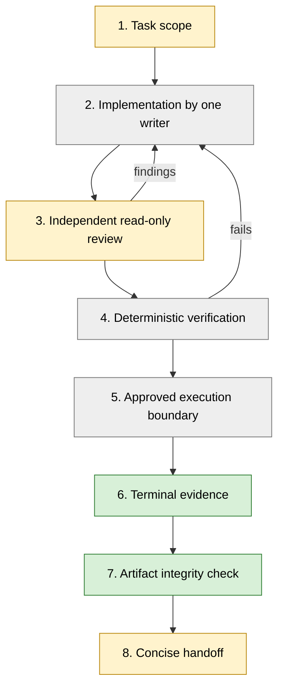

# Architecture

This page follows a change from task definition to handoff. It marks which
stages this repository only documents, which have a template, and which the
offline example demonstrates.

## Sequence

Green: demonstrated by the offline example. Yellow: template in `templates/`.
Grey: documented only.

| Stage | What it means | In this repository |
|---|---|---|
| 1. Task scope | Objective, allowed paths, non-goals, invariants, verification plan, stop conditions and acceptance criteria, written before work starts. | Template: [`templates/task.md`](../templates/task.md) |
| 2. One writer | Exactly one agent or person edits a checkout for the task. Others read only. | Documented only |
| 3. Independent review | Someone other than the writer inspects the exact revision read-only and reports findings with evidence and severity. A missing, failed or partial review is reported as such, not as approval. | Template: [`templates/review.md`](../templates/review.md) |
| 4. Deterministic verification | Tests and acceptance commands with a pass/fail result, run on the final revision. A reviewer's statement or an agent's summary does not replace them. | Documented; this repository's own tests and CI follow the rule but are not a general gate |
| 5. Approved execution boundary | Costly or remote execution starts only through one controlled path, with explicit authorization, from a known clean commit, with the resolved configuration recorded. | Documented design only (below) |
| 6. Terminal evidence | A run is classified from an explicit terminal record. No evidence means `UNKNOWN`. | Demonstrated offline with a synthetic record |
| 7. Artifact integrity | Outputs are checked against a manifest of relative paths, sizes and SHA-256 hashes. | Demonstrated offline |
| 8. Handoff | A short record of the current state, changed files, tests actually run, unresolved issues and the next bounded action. | Template: [`templates/handoff.md`](../templates/handoff.md) |

## Single writer and independent review

- The **writer** is the only process that edits files in the checkout for the
  task. It also runs the verification commands on the final revision.
- The **reviewer** has read-only access to the revision under review. It does
  not edit, commit, run jobs or publish. It returns findings with a location,
  evidence and severity, and states what it did not inspect.
- The writer accepts or rejects each finding with evidence. Rejected findings
  and anything left unreviewed go into the handoff.

In the private workflow, instruction files assign these roles to different
coding agents, and its review policy specifies a reviewer limited to read-only
tools. This repository contains only the templates. It does not launch agents
or enforce the roles.

## Commit and configuration binding (documented design)

The private workflow's instruction files require the following, so that a
cluster job runs known source with a known configuration:

- the local checkout is clean and its commit has been pushed;
- the cluster-side checkout is clean and at the same commit;
- the job re-checks the commit and cleanliness when it starts;
- the resolved configuration is preserved with the run.

The source commit and dirty state go into a run-scoped provenance record. The
private gateway code read for this write-up creates each record as a new file
with exclusive creation, so an existing record is not overwritten.

The instructions treat a mismatch as a blocker, not as a warning to log while
the job runs anyway.

This repository does none of this. It does not inspect Git, synchronize remotes
or talk to a scheduler. The demo's `config.json` is a synthetic stand-in. The
bundle has no source-revision field, because the demo has no verified source
revision to report.

## Guarded execution (documented design)

The private instruction files also specify:

- One gateway is the only route for submitting, polling, retrieving and
  cancelling jobs.
- Each submission needs explicit user authorization for that run. One
  authorization covers one submission.
- Resource requests are explicit. Unknown resource types fail closed.
- After uncertain transport, such as a dropped connection during submission,
  nothing is resubmitted automatically.

The public preview does not implement or imitate scheduler authorization,
replay protection, remote Git synchronization or multi-agent orchestration.

## Terminal evidence

**Missing terminal evidence is not success.** A job that has left the queue has
ended somehow, but not necessarily well. It may have hit a time or memory
limit, lost its node, or been cancelled, and its absence from the queue does
not say which.

The private gateway code read for this write-up classifies outcomes roughly
like this:

| Evidence available | Classification |
|---|---|
| Well-formed terminal record for this run, exit code 0 | Success |
| Well-formed terminal record for this run, nonzero exit code | Program failure |
| No record; job still queued or running | Still running |
| No record; scheduler log or state reports timeout, out-of-memory, node failure or cancellation | Killed |
| No record and no definitive termination evidence | Unknown, never success |
| Malformed record, or a record for a different run | Unknown |
| Scheduler unreachable | Unknown |

The offline demo implements the part that needs no scheduler:

| Demo status | Meaning | Exit code |
|---|---|---|
| `VERIFIED` | All artifacts intact; `COMPLETED` record with exit code 0, bound to the manifest | 0 |
| `FAILED` | Artifacts intact; record reports `FAILED` with a nonzero exit code | 1 |
| `UNKNOWN` | Artifacts intact; no terminal record | 1 |
| `INVALID` | Any integrity problem, or a malformed, inconsistent or unbound record | 1 |

## Artifact integrity

A manifest lists every output by relative path, size and SHA-256 hash. The
demo's verification:

- rejects absolute paths, `..` and `.` segments, and anything outside a simple
  allowed character pattern before touching the filesystem;
- refuses symlinks in any path component, so a listed path cannot resolve
  outside the bundle;
- compares the size and hash of every listed file and reports missing and
  unlisted files, and directories it cannot list;
- checks that the terminal record stores the manifest's own hash, so the
  recorded outcome and the artifact list refer to the same set of files.

What these checks do and do not establish is covered in
[verification-and-release-scope.md](verification-and-release-scope.md).
